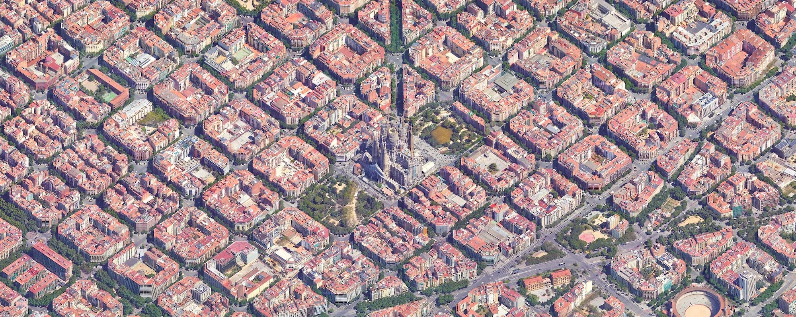
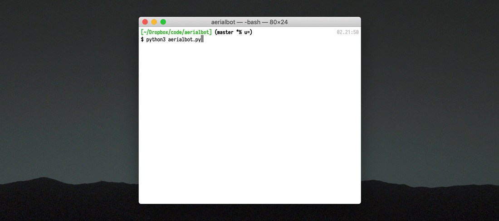

# ærialbot

*A simple yet highly configurable bot that tweets geotagged aerial imagery of a random location in the world.*

---

In a bit more detail, whenever you run ærialbot, it...

* **loads a [shapefile](https://en.wikipedia.org/wiki/Shapefile)** from disk,
* efficiently generates a **random point**꙳ within the bounds of this shape,
* figures out **which map tiles need to be downloaded** to cover a certain area around the point in sufficient꙳ detail,
* **downloads those map tiles** from a provider of your choice real fast (a threadpool is involved!),
* **stitches** them together and **crops** the resulting image to precisely match the configured area,
* **saves** that to disk,
* and **tweets** the image, optionally with a geotag.

Check out the following active ærialbot instances run by me...

* 🇺🇸 [@americasquared](https://twitter.com/americasquared), which tweets a satellite view of a randomly selected square mile of the United States every 8 hours (examples shown below).
* 🇰🇷 [@baekmanpyeong](https://twitter.com/baekmanpyeong), which tweets a square sized one million (백만, *baekman*) [pyeong](https://en.wikipedia.org/wiki/Pyeong) (평, traditional Korean area unit, roughly 3.3058 m²), i.e. 1.818×1.818 km, somewhere in South Korea once each day.
* 🗾 [@nihonmusuukei](https://twitter.com/nihonmusuukei) (*Nihon mu sū kei* = 日本無数景 ≈ 日本∞景, countless [views of Japan](https://en.wikipedia.org/wiki/One_Hundred_Famous_Views_of_Edo)), which tweets a square kilometer of Japan every 12 hours.
* 🇩🇪 [@zehnhektar](https://twitter.com/zehnhektar), which tweets a square sized 316×316 meters (*Zehn Hektar* = ten hectacres) somewhere in Germany every 12 hours.
* 🌍 [@placesfromorbit](https://twitter.com/placesfromorbit), a "worldwide" instance that tweets a 5×5 km square every 6 hours.
* 🌆 [@citiesatanangle](https://twitter.com/citiesatanangle), an instance that tweets tightly-zoomed 45-degree views of (sub)urban areas around the world every 8 hours.

...and others ([let me know](https://twitter.com/Doersino) if you want yours to be included):

* 🇩🇰 [@DanskKvadrat](https://twitter.com/DanskKvadrat) (run by [@Wegge](https://twitter.com/Wegge)), which focuses on Denmark and tweets a 2×2 km square every 4 hours.
* 🇷🇴 [@AerianRobot](https://twitter.com/AerianRobot) (not sure who runs it), which tweets a square-shaped portion of Romania twice each day.
* 🇳🇱 [@NL_kwadraat](https://twitter.com/NL_kwadraat) (run by [@michelbinkhorst](https://twitter.com/michelbinkhorst)), which tweets a 2×2 km square of the Netherlands three times each day.
* 🇳🇱 [@amsUpTop](https://twitter.com/amsUpTop) (run by [@kns008](https://twitter.com/kns008)), which tweets a random square of Amsterdam or its surroundings once a day.
* 🇹🇷 [@turkeyfromorbit](https://twitter.com/turkeyfromorbit) (run by [@btutal](https://twitter.com/btutal) and also active on [Instagram](https://www.instagram.com/turkeyfromorbit/)), where an ærialbot instance tweets square-kilometer-sized satellite images of Turkey while an [earthacrosstime](https://github.com/doersino/earthacrosstime) instance posts videos as described in the next sentence.

Also check out [@earthacrosstime](https://twitter.com/earthacrosstime), a "sibling" bot that tweets timelapse videos showcasing how random locations in the world have changed since 1984.

I've set up a [Twitter list](https://twitter.com/i/lists/1416308332529393672), enabling you to check out (and perhaps follow) all of them.

![One square mile each, somewhere in the United Sates, centered around (from top left to bottom right): 31.056747601478456,-89.61225567756193; 26.44943037843055,-97.69999657039938; 39.32223925968352,-95.06302508257909; 33.830621832157895,-102.7345327711916; 46.149781016546264,-108.95292330126662; 20.755048248172997,-156.98230879693344; 41.21859102806858,-83.97344375576749; 36.89466223259036,-89.52366337871948; 36.07100491499848,-115.26963797305373; 42.87888803844798,-113.90920385179305; 33.90737575723908,-113.46512478011427; 45.009510867796266, -117.01147828430616](example1.jpg)



*Tweeting can be disabled, meaning that this tool can serve as a high-resolution map downloader in a pinch. It newly – as of October 2021 – supports the 45-degree imagery available on Google Maps, such as this view of Barcleona, centered on the Basílica de la Sagrada Família.*


## Features

Here's why ærialbot is a [Good Bot](https://www.reddit.com/r/OutOfTheLoop/comments/6oca11/what_is_up_with_good_bot_bad_bot_comments/):

* **Configurability:** Take a look at `config.sample.ini` – you can supply your own shapefile (or instead define a fixed point), control output verbosity, set a different map tile provider (there's a bunch of presets, including oblique views), define the filenames of the result images, scale them to your preferred size, define the text of the tweet, and more!
* ꙳**Correctness:** Because neighboring meridians are closer at the poles than at the equator, uniformly sampling the allowable range of latitudes would bias the generated random points toward the poles. Instead, ærialbot makes sure they are distributed with regard to surface area. For the same reason (plus the Mercator projection), the number of map tiles required to cover an area depends on the latitude – ærialbot accounts for this, too.
* ꙳**Automatic zoom level determination:** Simply define the dimensions of the desired area around the generated point – ærialbot will then take care of dialing in a (more than) sufficient zoom level.
* **Comes with batteries included:** The `shapefiles/` directory contains a number of shapefiles to get you started, along with a guide on preparing further shapefiles for use with ærialbot.
* **Tile grabbing performance:** Multiple map tiles are downloaded in parallel, and there's a snazzy progress indicator (as you can see in the GIF below) to keep you updated on the download progress.
* **Geotagging:** Tweets will be geotagged with the precise location – you can disable this, of course.
* **Logging:** Keeps a log file – whether that's for debugging or reminiscing is your call. Again, you can disable this easily.




## Usage

### Setup

Being a good [Python 3](https://www.python.org) citizen, ærialbot uses `venv` to avoid dependency hell. Run the following commands to get it installed on your system:

```bash
$ git clone https://github.com/doersino/aerialbot
$ python3 -m venv aerialbot
$ cd aerialbot
$ source bin/activate
$ pip3 install -r requirements.txt
```

(To deactivate the virtual environment, run `deactivate`.)


### Configuration

Copy `config.sample.ini` to `config.ini` (via `cp config{.sample,}.ini` for some [Unix wizard vibes](https://twitter.com/thingskatedid/status/1391362019245260801) or just with your file manager like us normals), open it and modify it based on the (admittedly wordy) instructions in the comments.

See `shapefiles/README.md` for advice regarding finding shapefiles of the region you're interested in and preparing them for use with ærialbot.

*Feel free to [file an issue](https://github.com/doersino/aerialbot/issues) if anything's unclear!*


### Running

Once you've set everything up and configured it to your liking, run:

```bash
$ python3 aerialbot.py
```

That's basically it!

If you want your bot to tweet at predefined intervals, use `cron`, [`runwhen`](http://code.dogmap.org/runwhen/) or a similar tool. To make `cron` work with `venv`, you'll need to use bash and execute the `activate` script before running ærialbot (in this example, it runs every four hours at 30 minutes past the hour):

```
30 */4 * * * /usr/bin/env bash -c 'cd /PATH/TO/aerialbot && source bin/activate && python3 aerialbot.py'
```

*Pro tip:* If you want to host multiple instances of ærialbot, you don't need multiple copies of the code – multiple config files suffice: simply run `python3 aerialbot.py one-of-your-config-files.ini`.

*Uber pro tip:* Run `python3 aerialbot.py --help` to learn about some secret CLI options!


## FAQ

### Why the name?

Because it's cute and I like the "æ" ligature.

### Why did you make this tool?

Because satellite imagery [can be extremely beautiful](https://earthview.withgoogle.com), and I was looking for a way of regularly receiving high-resolution satellite views of arbitrary locations such as [the center pivot irrigation farms of the American heartland](http://www.thegreatamericangrid.com/archives/1441) or squares of the [Jefferson grid](https://kottke.org/15/08/the-jefferson-grid) in my Twitter timeline.

Note that I've built this tool (along with its predecessor [gomati](https://github.com/doersino/gomati)) during the COVID-19 pandemic – when it was, you know, just kinda nice to see the great outdoors *somehow*.

### Does this violate Google's terms of use?

*(That's only relevant if you configure ærialbot to download tiles from Google Maps, which is the default source – but [other tile providers do exist](https://github.com/ANAT01/map-list-servers/).)*

Probably. I haven't checked. But they haven't banned my IP for downloading tens of thousands of map tiles during development and testing, so you're probably good as long as you don't use this tool for downloading a centimeter-scale map of your country. What's more, I can't think of how an ærialbot-based Twitter bot would compete with or keep revenue from any of Google's products. (And it's always worth keeping in mind that Google is an incredibly profitable company that earns the bulk of its income via folks like you just going about their days surfing the ad-filled web.)

### Is there a [relevant XKCD](https://www.reddit.com/r/RelevantXKCD/)?

[You bet.](https://xkcd.com/1169/)

### Something is broken – can you fix it?

Possibly. Please feel free to [file an issue](https://github.com/doersino/aerialbot/issues) – I'll be sure to take a look!

## Future Work

*These are ideas more than anything else – don't expect them to be implemented any time soon.*

* Commission [@smolrobots](https://twitter.com/smolrobots/status/1224096411056320514) to draw a little mascot – maybe a satellite with a camera, or planet earth taking a selfie.
* Maybe split `aerialbot.py` up into multiple modules, take inspiration from [here](https://github.com/joaquinlpereyra/twitterImgBot). This might not be required right now, but would help if any of the ideas listed below are implemented.
* Add an option to use [OSM/Nominatim](https://nominatim.org/release-docs/develop/api/Reverse/) for reverse geocoding. This could go along with a refactor where a `ReverseGeocoder` interface is introduced, which two classes `TwitterReverseGeocoder` (with a constructor taking the Twitter credentials) and `OsmReverseGeocoder` implement. The config file would have to be extended with a reverse geocoder selection option, plus a reverse geocode string template and an explanation of the available variables (which may differ depending on the selected geocoder). This reverse geocode string would then be referencable in the tweet template.
* In addition to `GeoShape.random_geopoint`, also implement a `Shape.random_edge_geopoint` function for generating points on the edge of polygons (and polylines), and make it available via a config setting. This would 1. help test whether a given shapefile is accurate (and whether its projection is suitable), and 2. enable tweeting images of coasts or border regions, which might be interesting. Random point selection on polygon outlines would need to be done by randomly picking a segment of the outline via a distribution based on a prefix sum of the haversine distances along the outlines, then uniformly picking a point along the chosen segment (or linearly interpolating).
* Similarly, if a shapefile with (multi)points instead of a polygon or polyline is given, randomly select a location among those points. This could be used to set up a Twitter bot that tweets landmarks belonging to a certain category around the world (if such data is publicly available, that is – I'm sure [OSM data](https://wiki.openstreetmap.org/wiki/Shapefiles) could be [filtered](https://github.com/osmcode/pyosmium/blob/master/examples/filter_coastlines.py) accordingly). For example: [Airports](https://airports-list.com/iata-code).
* Support Bing Maps as a tile source. That'd involve parametrizing how map tiles are accessed since Bing Maps doesn't use the x-y-z coordinate system favored by most every other service, instead employing [its own "Quadkeys" tile indexing approach](https://docs.microsoft.com/en-us/bingmaps/articles/bing-maps-tile-system) which essentially encodes a path along a quad tree.
* Enable ærialbot to generate side views of areas with elevation data using [rayshader](https://www.tylermw.com/a-step-by-step-guide-to-making-3d-maps-with-satellite-imagery-in-r/). This would look super neat, but elevation data is probably not available at the required level of detail for most regions of the world, and I'm not sure if the available satellite imagery is aligned with reality well enough for this to look good. Probably not worth the effort.
* Build an [ambient device](https://en.wikipedia.org/wiki/Ambient_device), probably based around a Raspberry Pi and a square display like [this one](https://shop.pimoroni.com/products/hyperpixel-4-square?variant=30138251444307), that runs a variant of ærialbot that would download and display a new image (plus metadata) every time the user taps the screen or presses a button. It could be called "πinthesky" or something even more terrible. Basically, I envision this device to take the shape of a small wooden box sitting on a shelf or mantle. (I almost certainly won't build this because I've got enough screens in my life – so feel free to steal this idea under the condition of sending me a picture of the end result!)
